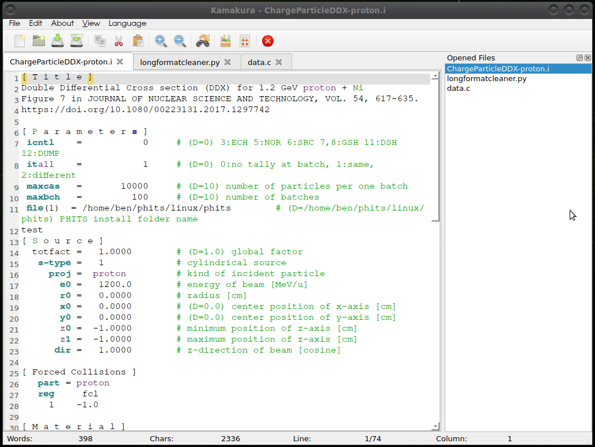
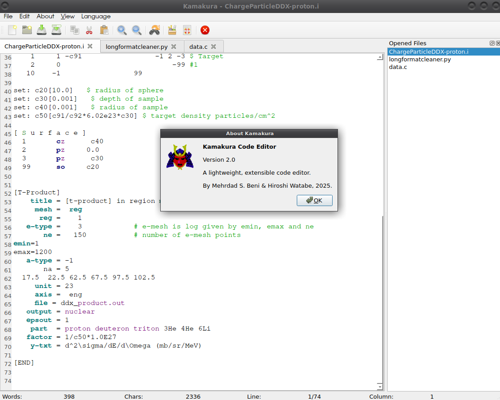
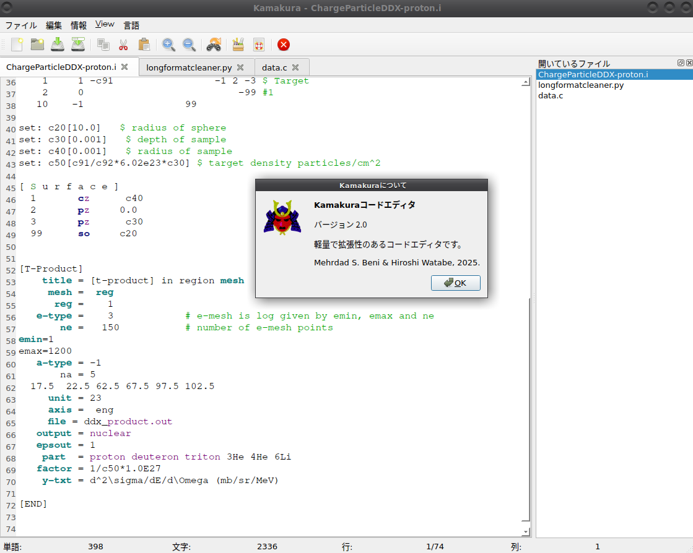

# Kamakura––


---

🎉 **Kamakura––** is your no-fuss, no-bloat Qt editor for PHITS input files. Type, tweak, and run your `.i`/`.inp` scripts (and more!) in style—no rocket science required!

---

## 🚀 Quick Start

1. **Clone or download** the repo.
2. Make sure you have Qt development tools installed:

   ```bash
   sudo apt install qtbase5-dev qt5-qmake   # Debian/Ubuntu
   # or use your favorite package manager on Windows/macOS
   ```
3. From the top-level directory, build and launch:

   ```bash
   qmake
   make
   ./Kamakura        # or double-click the generated binary
   ```

---

## 🎬 Video Clip



---

## 📸 Screenshots





---

## ✨ Features

* **Tabbed Editing**
  Juggle multiple files in one window: PHITS `.i`/`.inp`, Python, C/C++, Rust, Haskell, Fortran90, HTML, CSS, and more.

* **Syntax Highlighting**
  Smart coloring for PHITS keywords, Python, C/C++, Rust, Haskell, Fortran90, HTML, and CSS.

* **Search & Replace Dialog**
  Find that sneaky typo or replace multiple lines in a flash.

* **Live Document Metrics**
  Line count, word count, and more—right in the status bar.

* **Save / Save As**
  Keep your work safe with one click.

* **Dark Theme (Optional)**
  Give your eyes a break with a sleek, modern look.

* **Tab key Indentation**
  Now you can use tab key to do code indentation.

* **Word Wrap Toggle**
  Quickly switch line wrapping on or off from the View menu.

* **Language Toggle**
  Switch between English and Japanese language.

* **ChatGPT and Gemini integration**
  Use ChatGPT or Gemini LLM within Kamakura using your API key.
---

## 📦 Installation

1. **Dependencies** (examples for Debian/Ubuntu):

   ```bash
   sudo apt update
   sudo apt install qtbase5-dev qt5-qmake
   ```
2. **Build**:

   ```bash
   qmake
   make
   ```
3. **Run**:

   ```bash
   ./Kamakura
   ```

> Tip: On Windows/macOS, install the corresponding Qt SDK or use your package manager (e.g., Homebrew on macOS).

---

## 🎯 Why Kamakura––?

* **Minimalist by Design**
  No extra fluff—just the tools you need to edit PHITS input and more.

* **Super Light & Fast**
  Loads in a snap, so you can focus on your work, not on waiting.

* **Cross-Platform**
  Whether you’re on Linux, Windows, or macOS, Kamakura–– has your back.

---

## 🛠️ Contributing

1. Fork the repo.
2. Create a feature branch:

   ```bash
   git checkout -b feature/awesome-new-thing
   ```
3. Commit your changes:

   ```bash
   git commit -m "Add awesome new feature"
   ```
4. Push to your branch and open a Pull Request.

We love bug reports, feature requests, and pull requests—let’s make Kamakura–– even better together! 🚀

---

## 📜 License

Kamakura–– is released under the [GPLv3 License](LICENSE).
Feel free to clone, fork, and customize to your heart’s content!

---

##### Developed with 💙 by Mehrdad S. Beni & Hiroshi Watabe, CYRIC, Tohoku University (2023)
